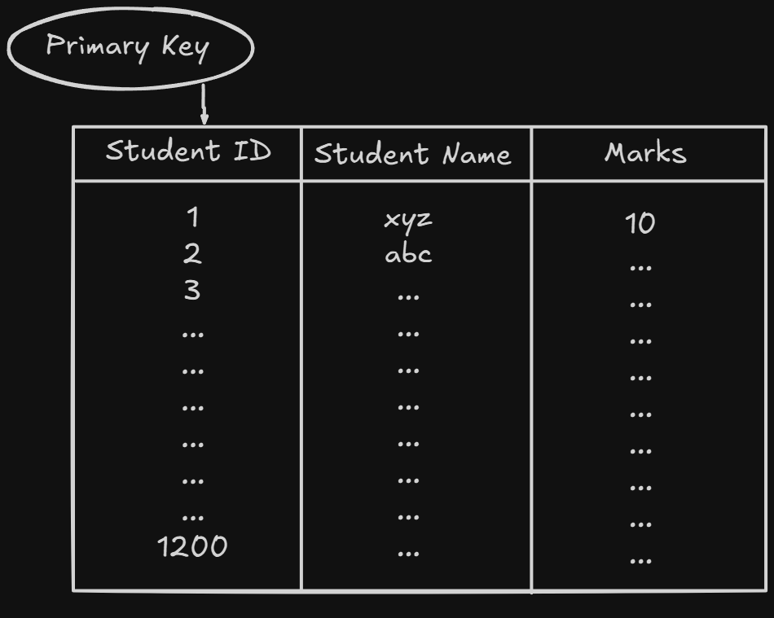
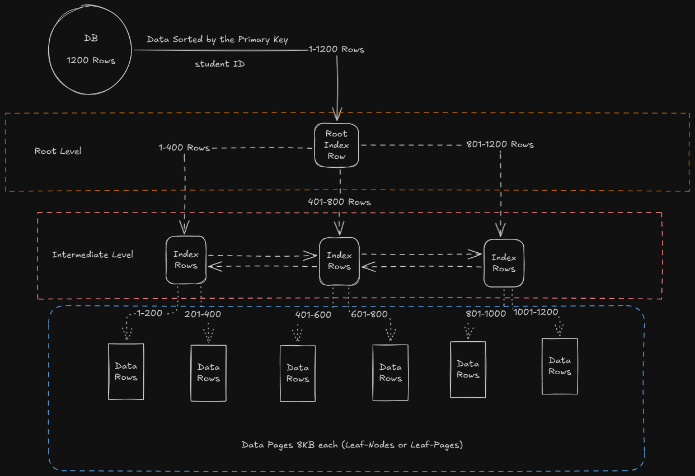
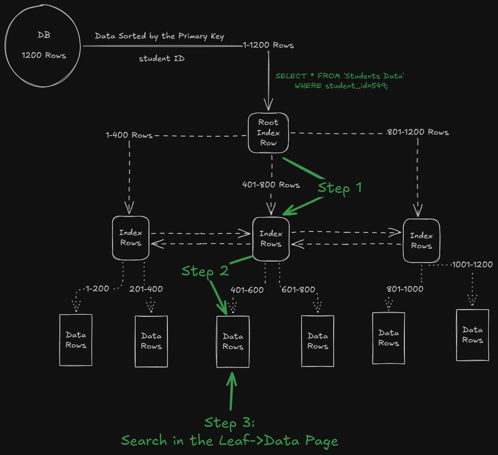

# How SQL store data in physical level

## Important Terminology

```
    1. B-Tree or Index B-Tree or Clustered
        Index Structure
    2. Data Pages
```

### B-Tree

* B-Tree is a **self-balancing tree**, just like Binary Search Tree, but with the benefit of having more than 2 children per node
* It is a much more flexible data structure
* The root and intermediate level nodes contain *index rows*
* Each *Index Row* contains a key-value, in our case, student_id and a pointer to an intermediate level of the B-Tree or a Data Page Node
* Refer to [B-tree (GFG)](https://www.geeksforgeeks.org/introduction-of-b-tree-2/) OR [B-Tree (Wiki)](https://en.wikipedia.org/wiki/B-tree)

### Data Pages

* The Basic or Fundamental unit of Data Storage in SQL Server 
* The data is stored in the Data Pages, at the Physical Level
* Data Pages have a fixed size of __8KB (Kilo Bytes)__
* These form the leaf-nodes of the B-Tree, which stores the data in the SQL tables
* The Data Stored in the SQL Server Tables, is stored in a *series of 8KB Data Pages*


## How data is stored Physically

 

* Assuming we have a SQL table, `Students Data`, where *Student ID* is the Primary Key
* The table has 1200 Rows
* At physical level, the data is stored inside the Data Pages, in a sorted manner based on the Primary Key, as a **Clustered Index** is created on the Primary Key 




> Note: Here, We have shown only 1 Intermediate Level, But in real world scenario, the number of Intermediate Levels may vary

* Here, we are assuming, that each Data Page stores 200 rows of the `Students Data` Table

* Say, a user writes a query as ->

> SELECT * FROM 'Students Data' Where Student_ID=549;

```
The flow goes as ->

Step 1 -> The Binary Search is applied to
    narrow down the search space and reach
    the Intermediate Level
Step 2 -> Binary Search is still working to
    find the Leaf-Data-Page, where the search
    space contains the desired student ID
Step 3 -> Searching the Data of the desired
    student ID in the Data Page

```



* Now, Say the user writes a query, say ->

> SELECT * FROM 'Students Data' WHERE student_name='lol';

* SQL will have to search each and every branch of the B-Tree to get the data from the query, as the data is not sorted or indexed based on the *student_name*
